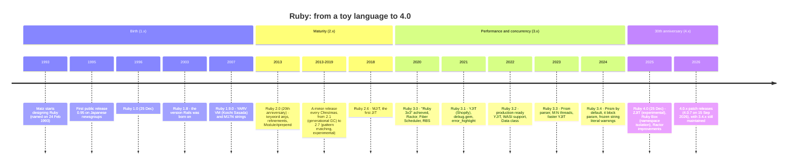
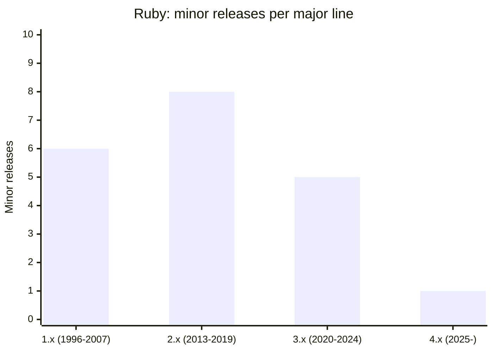
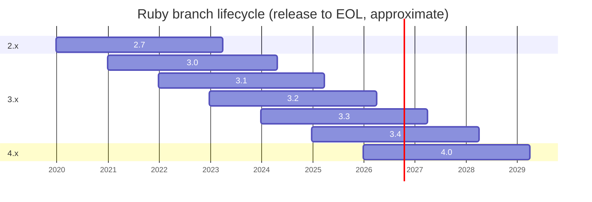
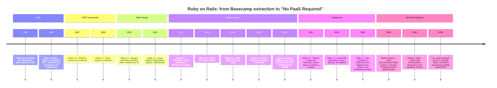
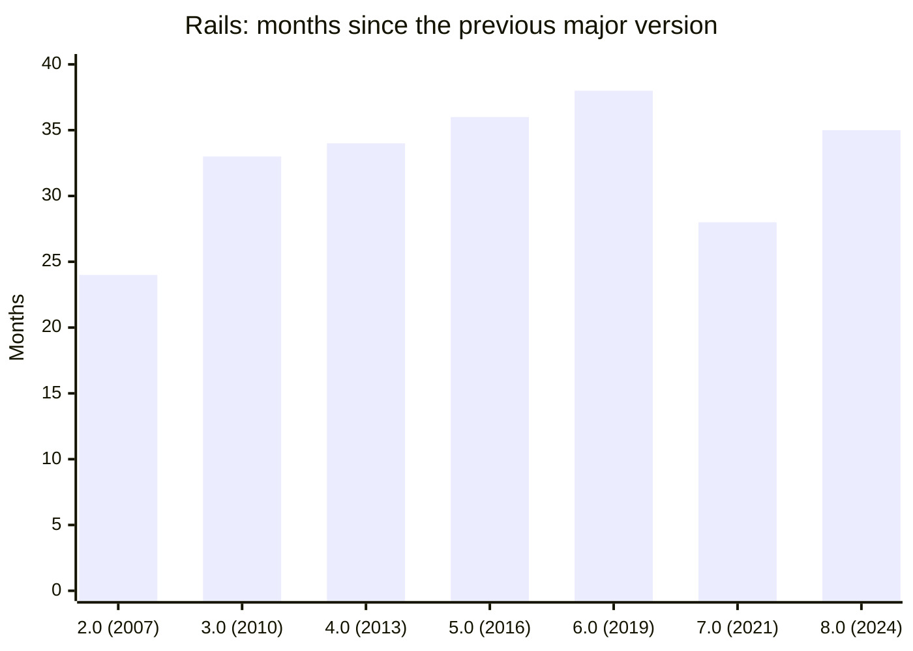
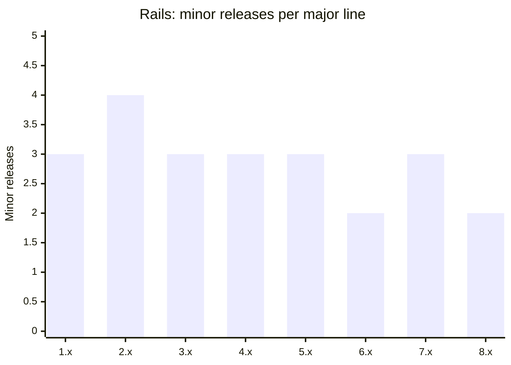
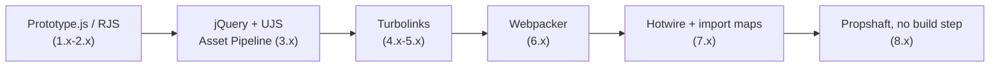
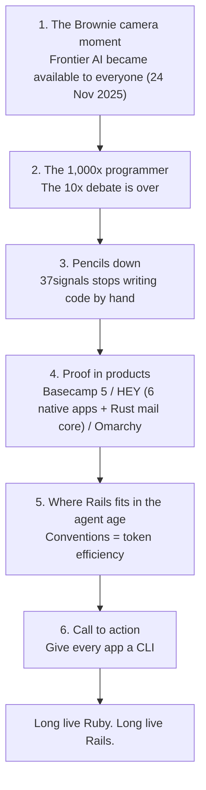
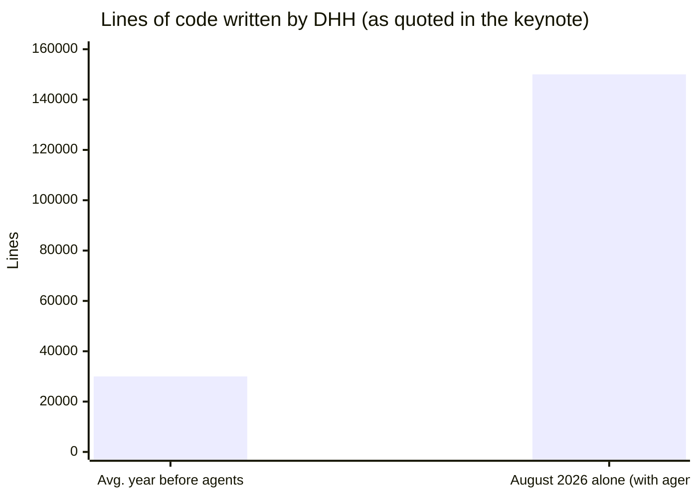

# @hayat01sh1da

## 1. プロフィール

- 氏名: 石田隼人
- 出身: 埼玉県
- 開発ドメイン: 教育(一身上の都合でお休み中)
- 趣味:
  - 愛猫(三毛猫♀)との戯れ🐈
  - アコースティックギター🎸
  - カラオケ🎤
  - LIVE 鑑賞(去年から今年にかけては Oasis と B'z と小田和正、今月は Pearl 主催イベントで Shane Gaalaas とラルクの yukihiro)
 
## 2. Ruby / Rails 周り(WIP)

- DHH の例の Keynote Speech は行間をめっちゃ汲み取る必要があるなと思った
  - Rails World という集大成の場で「Rails はもう終わり、これからは Rust だ！」は額面通りに受け取ってしまうと、とりわけコミッターやメンテナーが「やってらんねえよ」と匙を投げるリスクがあるので、そんな誰でも分かりそうな結末に着地するような愚かなことは作者自身がするとは思えなかった
  - Rails という良い意味で枯れた = アーキテクチャ(Philosophy)やフレームワーク層の最適解に則っていたから移行出来た単なる一例ではないだろうか？
  - "Rails is dead." は漸進的にはそうなるとは思うが、すぐにはそうならないと思った
    - Rails のフレームワーク層の挙動を堅牢・高速に出来る && アプリ層に書くコードの可読性を損なわない代替フレームワーク・言語の候補がある → Rails にこだわる必要はなくなっていく
    - 複雑なドメインが落とし込まれたプロダクトは以降難易度が高いので簡単にはいかないはず
  - "Rails is dead."  → "Ruby is dead." ?
    - Ruby がこれほど広まったのは Rails の普及が大きく寄与してきたので、Rails が終わったら Ruby を製品で採用する理由がなくなりそう

## 3. その他開発回り

- AI はコードを書かせるよりも、運用保守を試行錯誤しながら最適化していく方が有効な使い道という個人的所感

## 4. 最近の四方山

↑ Gibson Custom Shop Hummingbird Torch -Ebony Gloss- というお高い(¥536,000)エレアコギターを8月の頭に一括で買ってしまい緊縮財政中(懇親会不参加でお願いします)

---

個人メモ

## 5. The History of Ruby

### 5.1 Timeline

### 5.2 Minor releases per major version

> 1.x = 1.0, 1.2, 1.4, 1.6, 1.8, 1.9 (1.1/1.3/1.5/1.7 were development branches) / 2.x = 2.0 to 2.7 / 3.x = 3.0 to 3.4 / 4.x = 4.0

### 5.3 Support lifecycle of recent branches

> EOL dates for 3.3 and later follow the usual "about 3 years and 3 months" pattern. They are planned dates, not confirmed ones.

### 5.4 Key points

- **1.x: building the language (1993-2012)**
  - Matz wanted "a language more powerful than Perl and more object-oriented than Python", built on the idea of **developer happiness**.
  - Ruby 1.8 got worldwide attention because of Rails (2004-). Ruby 1.9 replaced the AST interpreter with the **YARV** bytecode VM and added encoding-aware strings. The 1.8 to 1.9 migration was painful and took the community years.
- **2.x: steady yearly releases (2013-2019)**
  - Since 2.1, a new minor version has come out **every 25 December**, and this rhythm continues today.
  - Main additions: keyword arguments, refinements, generational and incremental GC (2.1/2.2), `&.` (2.3), MJIT (2.6), compaction GC and experimental pattern matching (2.7).
- **3.x: speed, concurrency and types (2020-2024)**
  - **Ruby 3x3**: Ruby 3.0 is about 3x faster than 2.0 on benchmarks such as Optcarrot.
  - Concurrency: Ractor (actor-style parallelism), the Fiber Scheduler (non-blocking I/O) and M:N threads (3.3).
  - Types: RBS signatures and TypeProf, without changing the language syntax.
  - JIT: **YJIT** (made by Shopify, 3.1) replaced MJIT as the JIT to use in practice. It is production ready since 3.2 and powers large Rails apps.
  - Tooling: the **Prism** parser became the default in 3.4.
- **4.x: the 30th-anniversary major release (2025-)**
  - Ruby 4.0 came out on 25 Dec 2025, 30 years after Ruby 1.0. Its main features are experimental: **ZJIT** (a method-based JIT, the next step after YJIT) and **Ruby::Box** (isolated namespaces for definitions and loaded libraries).
  - As of Oct 2026, the latest releases are **4.0.7** (15 Sep 2026) and **3.4.11** (23 Sep 2026).

## 6. The History of Rails

### 6.1 Timeline

### 6.2 Time between major versions

### 6.3 Minor releases per major version

> 1.0-1.2 / 2.0-2.3 / 3.0-3.2 / 4.0-4.2 / 5.0-5.2 / 6.0-6.1 / 7.0-7.2 / 8.0-8.1 (as of Oct 2026)

### 6.4 How the frontend approach changed

### 6.5 Key points

- **Extracted, not designed**: Rails was taken out of a real product (Basecamp). The ideas that shaped the whole ecosystem were **Convention over Configuration**, **DRY** and later **The Rails Doctrine** (2016).
- **The Merb merger (3.0)** made Rails modular (Railties, ARel, Bundler) and ended the split in the community.
- **The "majestic monolith"** came back in the 7.x era. Instead of following SPA trends, Rails moved to **HTML-over-the-wire** with Hotwire and dropped the Node.js toolchain.
- **Rails 8, "No PaaS Required"**: the Solid trifecta (database-backed queue, cache and websockets) removes Redis. Kamal 2 and Thruster deploy to any server, and built-in authentication removes the need for Devise in simple cases. The aim is that **one developer can build and run a full app**.
- **Release policy (since 7.2)**: a minor version gets about **1 year of bug fixes and 2 years of security fixes**. Releases follow a **yearly rhythm, announced around Rails World** (2023: 7.1, 2024: 8.0, 2025: 8.1).
- **As of Oct 2026**: the latest stable version is **8.1.4** (24 Sep 2026), and 8.0.x still gets security fixes.

## 7. The Summary of DHH's Keynote Speech at Rails World 2026

- Video: [Rails World 2026 Opening Keynote - DHH](https://www.youtube.com/watch?v=vDjW_dRyKXY)
- Date / venue: 23 Sep 2026, Palmer Events Center, Austin, TX
- Follow-up session: "AI and the future of Ruby & Rails - a chat with Matz & DHH" (24 Sep)

### 7.1 Structure of the talk

### 7.2 DHH's own output (as he described it)

### 7.3 Key points

1. **The "Brownie camera" moment**
   - DHH named **24 Nov 2025** as the day frontier AI became usable by everyone. He compared it to the Kodak Brownie camera, which turned photography from a specialist job into something anyone could do. Programmers turn from "coders" into **makers**.
2. **From 10x to 1,000x**
   - He said the "10x programmer" debate is over. The gap between the worst programmer **without** agents and the best one **with** agents "approaches **1,000x**".
   - His own numbers: about **150,000 lines in August 2026 alone**, compared to a long-term average of about **30,000 lines a year**.
3. **"Pencils down"**
   - *"It's pencils down, people. Writing code by hand is no longer an economically viable skill for most programmers at most companies."*
   - 37signals no longer writes code by hand. Agent-written code is the default, and people code by hand only to fix what the agents got wrong. DHH said he had "retired from being a professional programmer".
4. **Lessons from 37signals' products**
   - **Basecamp 5**: an early experiment where designers "vibe-coded" with agents left the architecture "like Swiss cheese". Even so, the product shipped successfully with agent speed-ups.
   - **HEY**: it moves from one web app to **six native apps** written by agents. The **mail server core was rewritten in Rust**, which reported a ~99% CPU and ~95% memory reduction (the numbers vary between reports). He said it could in theory run on a Raspberry Pi.
   - **Omarchy** (DHH's Linux distribution): about $20M has been pledged to it. Install time went from 3m33s (Rails World 2025) to 35s, and to 9s in the lab. Agent-built apps such as *Hype* (Markdown slides) ship as binaries of about 0.5 MB.
5. **Why Rails still fits**
   - Convention over Configuration = **token efficiency**. Agents need less context to produce correct code, and that suits the one-person framework.
   - Evil Martians' agent evaluations on Rails already scored about 95% on the first benchmarks, so harder benchmarks are needed.
   - Traditional code abstractions can become a bottleneck when many agents change the same application at once. Architecture needs to be rethought for that.
6. **Call to action: build a CLI for every app**
   - Agents work best through command-line interfaces. His example was HEY's agent-powered conceptual search, which found a 5-year-old email from almost no context.

### 7.4 How it was received

- Critics said that, although the talk was billed as "what's new in Rails, what's coming next", it **barely mentioned Rails**. There were **no new Rails features and no Rails 9**. The Rust rewrite of HEY was read by many as "Rails/Ruby is dead".
- DHH ended with *"Long live Ruby. Long live Rails."* He presents Rails as a productive, convention-heavy layer for small teams working with agents, while hot paths with heavy performance needs (like HEY's mail core) move to Rust.

> Sources: [Rails World 2026 talk page](https://app.railsworld.com/talks/rails-world-2026-opening-keynote), [Dealroom summary](https://dealroom.co/news/talk-vDjW_dRyKXY-pencils-down-dhh-declares-the-end-of-hand-written-code/), [Dark Factory Dev](https://darkfactory.dev/news/2026-09-25-morning/story-1), [Hacker News thread](https://news.ycombinator.com/item?id=49817680). The YouTube transcript itself could not be fetched, so the numbers above come from these secondary reports.

